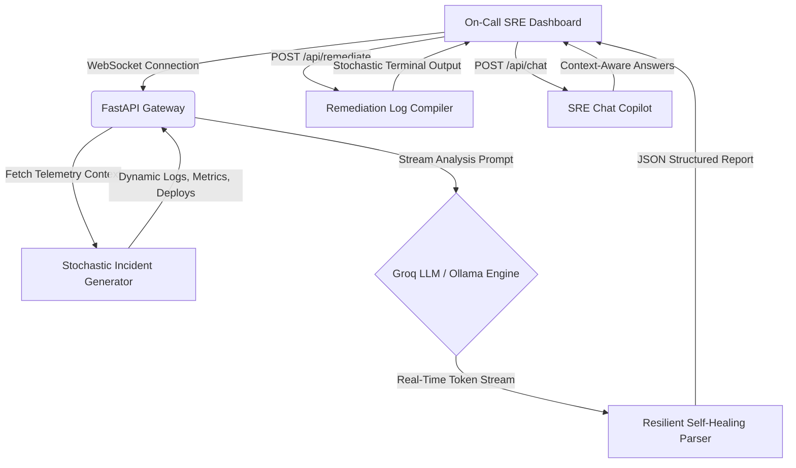

# ⚡ NEXUS — AI Incident Root Cause Analyzer 
> **"Turn a stressful 2 AM production outage into a fully solved, remediated problem in under 30 seconds."**

[](https://github.com/)
[](https://github.com/)
[](https://github.com/)

NEXUS is an elite, high-fidelity AI-powered Site Reliability Engineering (SRE) Operations Center that automatically correlates logs, metric telemetry, and deployment history to diagnose and auto-remediate production incidents with surgical precision. 

Built for modern distributed microservice infrastructures, it replaces the stressful 45-minute search across dashboards and log tabs during an outage with a **stochastic, real-time diagnostic engine** in seconds.

---

## 🚀 Key Capabilities

* **100% Stochastic Incident Generation:** Generates hyper-detailed, relative-timestamped microservice incident contexts (logs, metric profiles, version tags, commit hashes, pull requests) dynamically on runtime startup via LLM structures or smart Python telemetry models.
* **Streaming AI SRE Logic:** Establishes direct WebSockets to Groq (`llama-3.1-8b-instant`) or Ollama (`llama3.1:8b`) to stream real-time, step-by-step reasoning outputs representing hypothesis formation,blast-radius mapping, and root-cause confirmation.
* **Resilient Self-Healing Parser:** Implements a multi-layered regex and brace-repair parser that intercepts malformed, incomplete, or markdown-wrapped LLM JSON streams, guaranteeing high-fidelity rendering without static fallbacks.
* **Stochastic Automated Remediation:** Generates customized, microsecond-timestamped terminal outputs dynamically matched to the proposed SRE fix command (extracting namespaces, generating random container IDs, and verifying readiness probes).
* **War Room SRE Chat Copilot:** Nested directly inside the operations card, a dark military-ops styled chat window lets engineers query incident context, logs, metric deadlocks, or rollback steps dynamically with the AI brain.

---

## 🛠️ Architecture Blueprint



---

## 📦 Directory Structure

```
Nexus_Incidents/
├── backend/
│   ├── integrations/
│   │   ├── datadog.py       # Live Datadog metrics and monitors API
│   │   ├── pagerduty.py     # Live PagerDuty incident management API
│   │   └── simulate.py      # High-fidelity sandbox mocks
│   ├── .env.example         # System configurations template
│   ├── main.py              # Core FastAPI app, WebSockets & stochastic API routes
│   └── requirements.txt     # Python backend dependencies
├── frontend/
│   ├── src/
│   │   ├── assets/          # Brand static images
│   │   ├── App.css          # Styling layers
│   │   ├── App.jsx          # Elite Dark Ops React Dashboard & SRE Copilot
│   │   ├── index.css        # Global CSS variables & typography tokens
│   │   └── main.jsx         # App entrypoint
│   ├── index.html           # HTML Layout with Outfit & JetBrains Mono Fonts
│   ├── package.json         # Node workspace dependencies
│   └── vite.config.js       # Vite proxy config mapping relative proxies
└── README.md                # World-Class submission manual
```

---

## ⚡ Quick Start (Under 2 Minutes)

### 1. Initialize the Backend
Ensure you are running on Python 3.10+ and execute:
```bash
cd backend
python -m venv venv
# Windows PowerShell:
.\venv\Scripts\Activate.ps1
# Mac/Linux:
source venv/bin/activate

pip install -r requirements.txt
cp .env.example .env
```
Update `.env` to include your Groq API Key:
```env
ENV=prod
GROQ_API_KEY=gsk_your_key_here
```
Fire up the FastAPI ASGI server:
```bash
uvicorn main:app --reload --port 8000
```

### 2. Launch the Frontend
In a secondary terminal tab:
```bash
cd frontend
npm install
npm run dev
```

Visit [http://localhost:5173](http://localhost:5173) to assume your role as the SRE Commander in the War Room!

---

## ⚡ Dynamic SRE Scenarios

Every runtime startup compiles 3 unique incidents with relative timestamps matching your **actual current local time**:

1. **P0: Payment Service Exception Outage (Deployment Regression)**
   * *Anomaly:* Rising HTTP 500 error rates immediately following a rolling upgrade.
   * *Root Cause:* A missing null-pointer guard on billing address parameters causing charge transactions to crash.
2. **P1: Database Connection Starvation (Resource Exhaustion)**
   * *Anomaly:* Gateway API latency spikes from 180ms to over 12 seconds.
   * *Root Cause:* An unindexed, offline analytics cron query scanning 45M rows and locking connection pools.
3. **P2: JVM Cache Embedding Throttling (Memory Leak)**
   * *Anomaly:* Recurring microservice pod crashes (OOMKilled exit code 137).
   * *Root Cause:* An unbounded in-memory embedding cache introduced yesterday without LRU or TTL eviction policies.

---

## 🛡️ Premium Design Specs

NEXUS implements a **Military Command Center** operations aesthetic engineered to deliver maximum cognitive clarity under high stress:
* **Typography:** [Outfit](https://fonts.google.com/specimen/Outfit) for sleek UI metrics and controls, [JetBrains Mono](https://fonts.google.com/specimen/JetBrains+Mono) for raw logs and terminal executions.
* **Color Palette:** Curated harmonious HSL layout using `#0A0E1A` (deep ops black), `#00D4FF` (cyber cyan), `#FF3B3B` (critical red), and `#00E87A` (healthy green).
* **Interactions:** Liquid-smooth cubic-bezier layout morphing, pulse-dots, scanlines, and Framer Motion spring overlays.
