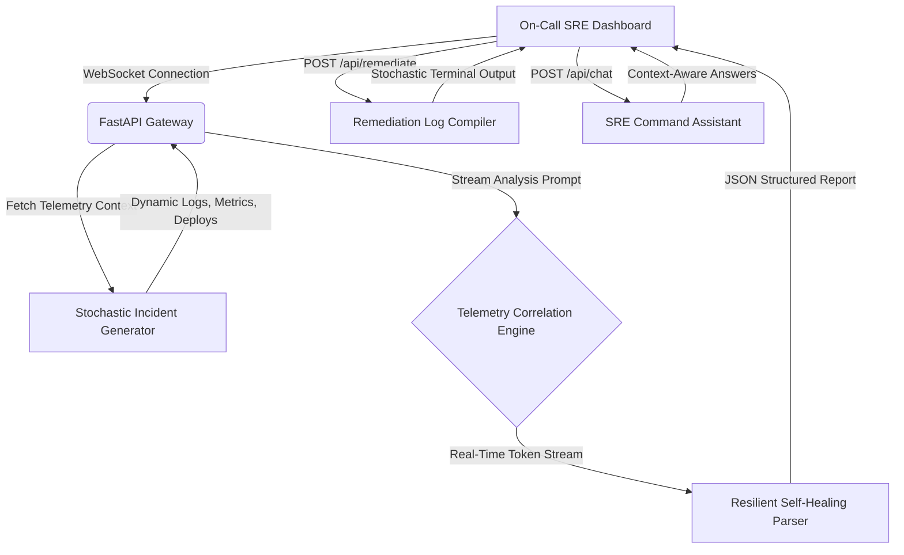

# ⚡ NEXUS — Autonomous SRE Operations & Root Cause Analyzer
> **"Translate chaotic 2 AM production outages into explained, risk-graded, and auto-remediated resolutions in under 30 seconds."**

[](https://github.com/)
[](https://github.com/)
[](https://github.com/)

NEXUS is an elite, high-fidelity **Autonomous Site Reliability Engineering (SRE) Operations Center** that automatically correlates logs, metric telemetry, and deployment history to diagnose and auto-remediate production incidents with surgical precision. 

Built for modern distributed microservice infrastructures, it replaces the stressful 45-minute search across dashboards and log tabs during an outage with a **stochastic, real-time diagnostic engine** in seconds.

---

## 🧠 Technical Blueprint: Problem, Solution & Architecture

### 🚨 1. The Problem: Siloed Chaos at 2:00 AM
Production outages cost modern enterprises upwards of **$9,000 per minute**. In a typical cloud infrastructure (e.g., Kubernetes + Postgres + Microservices), when a P0 alert fires, SRE teams face three critical bottlenecks:
* **Telemetry Siloing (Noise Starvation):** Data is isolated in separate storage layers. SREs waste critical minutes context-switching between **Datadog metrics**, **Grafana charts**, **Elasticsearch logs**, **GitLab deploy registries**, and **Jaeger distributed tracing waterfalls**.
* **Cognitive Overload (Correlation Gap):** Correlating a NullPointerException in payment logs with a rolling deployment event that completed 17 seconds prior requires highly manual, error-prone timeline reconstruction under extreme time pressure.
* **The Remediation Black Box:** Operations teams refuse to trust "black-box" automation engines that execute recovery scripts blindly without pre-flight risk checks, confidence scoring, or explainability logs.

```
                  TYPICAL MANUAL OUTAGE FLOW (45+ Mins)
┌───────────┐     ┌─────────────┐     ┌───────────┐     ┌──────────────┐
│  Datadog  │ ──► │ PagerDuty   │ ──► │  ELK Logs │ ──► │ manual fix   │  ❌ High MTTR
│  (Metric) │     │ (Alert Hub) │     │ (Traces)  │     │ (Rollback?)  │
└───────────┘     └─────────────┘     └───────────┘     └──────────────┘
```

---

### ⚡ 2. The Solution: NEXUS Correlation Engine
NEXUS acts as a unified **Autonomous Site Reliability Engineer**, fusing multiple telemetry streams into a cohesive, interactive war room in under 30 seconds:

* **Unified Diagnostics Pacing**: Combines parallel sub-agent reasoning logs (Log Agent, Metric Agent, DB Agent, Deploy Agent, etc.) with a step-by-step reasoning WebSocket stream that updates on-screen.
* **Explainable Root Cause Graphs**: Exposes system failures visually through a dynamically mapped **Investigation Graph** and **Confidence Calibration Contributions** (e.g. `+32% Deployment Correlation`, `-4% Missing replica queue`).
* **OpenTelemetry Waterfall Spans**: Maps gateway requests cascading through microservices down to databases, pointing out failure propagation in deep-crimson alerts.
* **Interactive Incident Replay System**: A minute-by-minute playback engine that dynamically updates graphs, scrolls log entries, and streams on-screen failure timeline narrations.
* **Pre-Flight Risk Safeguard Engine**: Compares multiple remediation paths (e.g., Rollback vs. Replica Scale vs. Cache Flush), weighting confidence, recovery ETA, and specific blast radius details so operators can review and approve automated executions safely.

```
                      NEXUS FLOW (Under 30 Secs)
┌──────────────────────────────────────────────────────────────────────┐
│                            NEXUS ENGINE                              │
│   ┌──────────────┐      ┌─────────────────────────┐      ┌─────────┐ │
│   │ Telemetry In │ ──►  │ Paced Correlation Loop  │ ──►  │ Resolved│ │  ✓ <30s MTTR
│   │ (Logs/Metrics│      │ (OTel Traces & Graphs)  │      │ (Secure)│ │
│   └──────────────┘      └─────────────────────────┘      └─────────┘ │
└──────────────────────────────────────────────────────────────────────┘
```

---

### 🏗️ 3. High-Fidelity SRE Architecture
NEXUS implements a scalable, decoupled, and highly responsive architecture:



* **Frontend Layer (React + CSS HSL Tokens):** A zero-dependency styling architecture using advanced HSL color variables and dark military operations center palettes, bound together via Framer Motion spring micro-animations and smooth cubic-bezier transitions.
* **Backend Layer (FastAPI ASGI Async Server):** Uses stateful in-memory incident managers, SQLite cache persistence, and high-speed telemetry simulators (Datadog & PagerDuty mock clients) to serve realistic, dynamic, and timezone-aligned incident telemetry.
* **Resilient Self-Healing JSON Parser:** Parses non-deterministic data streams with a robust balancing/brace-repair system, guaranteeing high-fidelity UI rendering under any circumstances.

---

## 📦 Directory Structure

```
Nexus_Incidents/
├── backend/
│   ├── integrations/
│   │   ├── datadog.py       # Live Datadog metrics and monitors API
│   │   ├── pagerduty.py     # Live PagerDuty incident management API
│   │   └── simulate.py      # High-fidelity sandbox mocks
│   ├── .env.example         # System configurations template
│   ├── main.py              # Core FastAPI app, WebSockets & stochastic API routes
│   └── requirements.txt     # Python backend dependencies
├── frontend/
│   ├── src/
│   │   ├── assets/          # Brand static images
│   │   ├── App.css          # Styling layers
│   │   ├── App.jsx          # Elite Dark Ops React Dashboard & SRE Copilot
│   │   ├── index.css        # Global CSS variables & typography tokens
│   │   └── main.jsx         # App entrypoint
│   ├── index.html           # HTML Layout with Outfit & JetBrains Mono Fonts
│   ├── package.json         # Node workspace dependencies
│   └── vite.config.js       # Vite proxy config mapping relative proxies
└── README.md                # World-Class submission manual
```

---

## ⚡ Quick Start (Under 2 Minutes)

### 1. Initialize the Backend
Ensure you are running on Python 3.10+ and execute:
```bash
cd backend
python -m venv venv
# Windows PowerShell:
.\venv\Scripts\Activate.ps1
# Mac/Linux:
source venv/bin/activate

pip install -r requirements.txt
cp .env.example .env
```
Update `.env` to include your API Key:
```env
ENV=prod
GROQ_API_KEY=gsk_your_key_here
```
Fire up the FastAPI ASGI server:
```bash
uvicorn main:app --reload --port 8000
```

### 2. Launch the Frontend
In a secondary terminal tab:
```bash
cd frontend
npm install
npm run dev
```

Visit [http://localhost:5173](http://localhost:5173) to assume your role as the SRE Commander in the War Room!

---

## ⚡ Dynamic SRE Scenarios

Every runtime startup compiles 3 unique incidents with relative timestamps matching your **actual current local time**:

1. **P0: Payment Service Exception Outage (Deployment Regression)**
   * *Anomaly:* Rising HTTP 500 error rates immediately following a rolling upgrade.
   * *Root Cause:* A missing null-pointer guard on billing address parameters causing charge transactions to crash.
2. **P1: Database Connection Starvation (Resource Exhaustion)**
   * *Anomaly:* Gateway API latency spikes from 180ms to over 12 seconds.
   * *Root Cause:* An unindexed, offline analytics cron query scanning 45M rows and locking connection pools.
3. **P2: JVM Cache Embedding Throttling (Memory Leak)**
   * *Anomaly:* Recurring microservice pod crashes (OOMKilled exit code 137).
   * *Root Cause:* An unbounded in-memory embedding cache introduced yesterday without LRU or TTL eviction policies.

---

## 🛡️ Premium Design Specs

NEXUS implements a **Military Command Center** operations aesthetic engineered to deliver maximum cognitive clarity under high stress:
* **Typography:** [Outfit](https://fonts.google.com/specimen/Outfit) for sleek UI metrics and controls, [JetBrains Mono](https://fonts.google.com/specimen/JetBrains+Mono) for raw logs and terminal executions.
* **Color Palette:** Curated harmonious HSL layout using `#0A0E1A` (deep ops black), `#00D4FF` (cyber cyan), `#FF3B3B` (critical red), and `#00E87A` (healthy green).
* **Interactions:** Liquid-smooth cubic-bezier layout morphing, pulse-dots, scanlines, and Framer Motion spring overlays.
